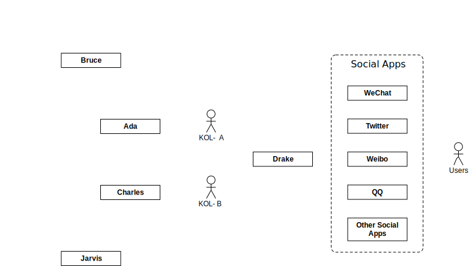
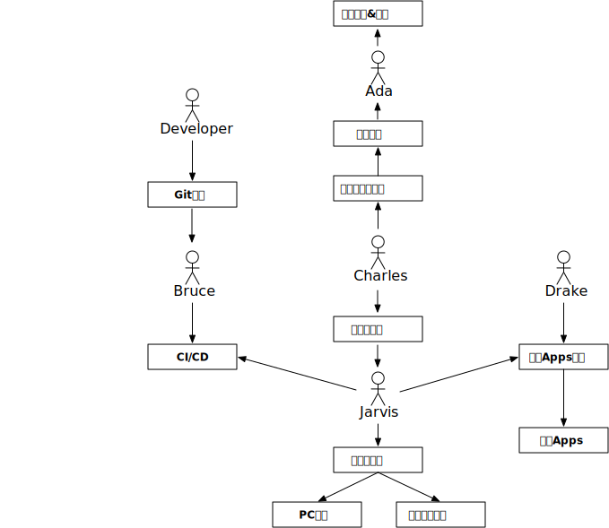

# 我们的产品

有趣的人 + AI  
利用高效的AI来放大KOL价值。  

举个例子，譬如我们现在想买吉列的剃须刀，我们简单的过了一下在阿里家自然搜索最前面的60个页面，一共可以找到1001种商品，整合分析后，发现一共有137种打包组合，数据如下：

|商品打包组合|sku数量|
|---|---|
|刀头(锋隐) 送 硅胶套|2|
|刀头(锋隐) 送 收纳盒|4|
|刀头(锋隐) 送 底座|1|
|刀头(锋隐) 送 剃须泡|3|
|刀头(锋隐) + 刀架(锋隐) 送 硅胶套|11|
|刀头(锋隐) + 刀架(锋隐) 送 收纳盒|8|
|刀头(锋隐) + 刀架(锋隐) 送 底座|1|
|刀头(锋隐) + 刀架(锋隐) 送 啫喱 / 收纳盒|1|
|刀头(锋隐) + 刀架(锋隐) 送 剃须泡 / 收纳盒|3|
|刀头(锋隐) + 刀架(锋隐) 送 剃须泡|4|
|刀头(锋隐) + 刀架(锋隐) + 磁吸底座 送 硅胶套|14|
|刀头(锋隐) + 刀架(锋隐) + 磁吸底座 送 收纳盒|3|
|刀头(锋隐) + 刀架(锋隐) + 磁吸底座 送 啫喱 / 硅胶套|1|
|刀头(锋隐) + 刀架(锋隐) + 磁吸底座 送 剃须泡 / 硅胶套|2|
|刀头(锋隐) + 刀架(锋隐) + 磁吸底座 送 剃须泡|11|
|刀头(锋隐) + 刀架(锋隐) + 磁吸底座|9|
|刀头(锋隐) + 刀架(锋隐)|18|
|刀头(锋隐)|15|
|刀头(锋速) 送 硅胶套|2|
|刀头(锋速) 送 收纳盒|6|
|刀头(锋速) 送 啫喱 / 硅胶套|1|
|刀头(锋速) + 刀架(锋速) 送 硅胶套|2|
|刀头(锋速) + 刀架(锋速) 送 收纳盒|5|
|刀头(锋速) + 刀架(锋速) 送 啫喱 / 硅胶套|2|
|刀头(锋速) + 刀架(锋速) 送 啫喱 / 收纳盒|2|
|刀头(锋速) + 刀架(锋速) 送 剃须泡 / 收纳盒|3|
|刀头(威锋) 送 硅胶套|1|
|刀头(威锋) 送 收纳盒|3|
|刀头(威锋) 送 剃须泡|2|
|刀头(威锋) + 刀架(威锋) 送 硅胶套|2|
|刀头(威锋) + 刀架(威锋) 送 收纳盒|4|
|刀头(威锋) + 刀架(威锋) 送 啫喱 / 硅胶套|1|
|刀头(威锋) + 刀架(威锋) 送 剃须泡 / 收纳盒|1|
|刀头(威锋) + 刀架(威锋) 送 剃须泡 / 剃须泡 / 收纳盒|1|
|刀头(威锋) + 刀架(威锋) 送 剃须泡|1|
|刀头(威锋) + 刀架(威锋)|3|
|刀头(威锋)|5|
|刀头(云感) 送 硅胶套|4|
|刀头(云感) + 刀架(云感) 送 硅胶套|5|
|刀头(云感) + 刀架(云感) 送 洁面乳 / 硅胶套|3|
|刀头(云感) + 刀架(云感) 送 剃须泡 / 硅胶套|10|

这些商品里，随便选一个，数据可能是这样的：

其中，价格差最大20%多，在国内的电商规则下。而且，这些商品的平均月销量是3595件，不算是一个特别小众的分类了。

那么如果一个人，完成上面的数据分析大概要多久呢？1001件商品，光分类到137种，估计就得花小半天，这样的数据一天变几次其实都是有可能的。

我们就是提供一个AI助理团队，帮助KOL分析整理数据、选品并筛选出对用户更优的组合。

我们的产品本质上是一套AI自动化工具（AI？或算法？），他们是：

负责基础运维支撑的 Jarvis（名字来源于钢铁侠的私人助理），他可以控制PC机和移动终端（手机等），是一个分布式的任务分派网络。

负责渲染输出的 Ada （名字来源于生化危机游戏里美女间谍），她帮助我们输出各种报表和文章，能帮助管理、可视化数据。

负责内部研发流程的 Bruce （名字来源于蝙蝠侠），他行走于黑暗之中，在背后处理各种CI/CD流程，辅助QA团队，实现全球节点的监控测试。

负责数据分析的超脑 Charles （名字来源于XMan里的X教授），他通过Jarvis来获取各种数据，进行数据分析。

负责社交媒体的 Drake （名字来源于游戏神秘海域），Drake 会监控各种社交媒体，并提供统一的基础处理回复。

