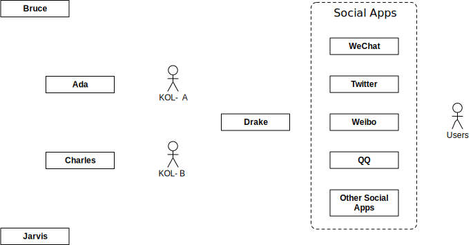
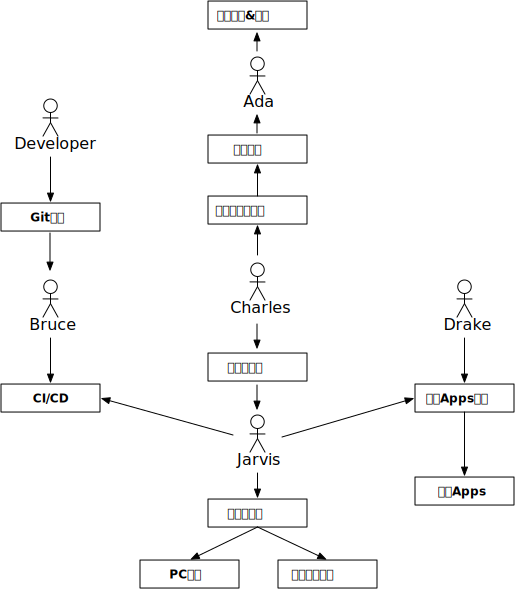

# 我们的产品

有趣的人 + AI  
利用高效的AI来放大KOL价值。  

KOL已经是各品牌不可忽视的一股力量了，大多数头部KOL都已经是一个团队在背后支撑，我们希望能为更多的KOL提供支持，提升他们的数据采集整理效率和IT效率。  
我们构想的模式如下：

举个例子，譬如有个用户希望某个KOL能帮自己推荐一下吉列的剃须刀，我们采集了淘宝（含天猫）自然搜索最前面的60个页面，一共可以找到22个不同商家的1001种商品（SKU，一个页面平均16个SKU），这22个商家都属于比较大的商家，大部分都是天猫店，商品都是包邮的。

我们将这些数据分类整合后，发现一共有128种打包组合（不同型号不同组合，忽略数量），数据如下：

|商品打包组合|sku数量|
|---|---|
|刀头(锋隐) 送 硅胶套|17|
|刀头(锋隐) 送 收纳盒|32|
|刀头(锋隐) 送 底座 / 硅胶套|1|
|刀头(锋隐) 送 底座|2|
|刀头(锋隐) 送 啫喱 / 硅胶套|2|
|刀头(锋隐) 送 啫喱|4|
|刀头(锋隐) 送 剃须泡 / 硅胶套|4|
|刀头(锋隐) 送 剃须泡 / 收纳盒|2|
|刀头(锋隐) 送 剃须泡|13|
|刀头(锋隐) + 刀架(锋隐) 送 硅胶套|39|
|刀头(锋隐) + 刀架(锋隐) 送 收纳盒|24|
|刀头(锋隐) + 刀架(锋隐) 送 底座|1|
|刀头(锋隐) + 刀架(锋隐) 送 啫喱 / 硅胶套|11|
|刀头(锋隐) + 刀架(锋隐) 送 啫喱 / 收纳盒|1|
|刀头(锋隐) + 刀架(锋隐) 送 啫喱 / 啫喱 / 硅胶套|1|
|刀头(锋隐) + 刀架(锋隐) 送 啫喱|3|
|刀头(锋隐) + 刀架(锋隐) 送 剃须泡 / 硅胶套|15|
|刀头(锋隐) + 刀架(锋隐) 送 剃须泡 / 收纳盒|6|
|刀头(锋隐) + 刀架(锋隐) 送 剃须泡|11|
|刀头(锋隐) + 刀架(锋隐)|38|
|刀头(锋隐) + 刀头(致顺) + 刀架(锋隐)|1|
|刀头(锋隐)|51|
|刀头(锋速) 送 硅胶套|3|
|刀头(锋速) 送 收纳盒|9|
|刀头(锋速) 送 啫喱 / 硅胶套|1|
|刀头(锋速) 送 啫喱|1|
|刀头(锋速) 送 剃须泡 / 收纳盒|4|
|刀头(锋速) 送 剃须泡|5|
|刀头(锋速) 送 刀架挂|2|
|刀头(锋速) + 刀架(锋速) 送 硅胶套|4|
|刀头(锋速) + 刀架(锋速) 送 收纳盒|11|
|刀头(锋速) + 刀架(锋速) 送 啫喱 / 硅胶套|2|
|刀头(锋速) + 刀架(锋速) 送 啫喱 / 收纳盒|3|
|刀头(锋速) + 刀架(锋速) 送 啫喱|3|
|刀头(锋速) + 刀架(锋速) 送 剃须泡 / 收纳盒|5|
|刀头(锋速) + 刀架(锋速) 送 剃须泡|3|
|刀头(锋速) + 刀架(锋速) 送 刀架挂|1|
|刀头(锋速) + 刀架(锋速)|10|
|刀头(锋速)|5|
|刀头(致顺) 送 硅胶套|18|
|刀头(致顺) 送 收纳盒|13|
|刀头(致顺) 送 底座|1|
|刀头(致顺) 送 啫喱 / 啫喱|1|
|刀头(致顺) 送 啫喱|3|
|刀头(致顺) 送 剃须泡 / 硅胶套|2|
|刀头(致顺) 送 剃须泡 / 收纳盒|2|
|刀头(致顺) 送 剃须泡|11|
|刀头(致顺) + 刀架(致顺) 送 硅胶套|37|
|刀头(致顺) + 刀架(致顺) 送 收纳盒|21|
|刀头(致顺) + 刀架(致顺) 送 啫喱 / 硅胶套|17|
|刀头(致顺) + 刀架(致顺) 送 啫喱 / 收纳盒|3|
|刀头(致顺) + 刀架(致顺) 送 啫喱|8|
|刀头(致顺) + 刀架(致顺) 送 剃须泡 / 硅胶套|10|
|刀头(致顺) + 刀架(致顺) 送 剃须泡 / 收纳盒|9|
|刀头(致顺) + 刀架(致顺) 送 剃须泡|6|
|刀头(致顺) + 刀架(致顺) 送 刀架挂|1|
|刀头(致顺) + 刀架(致顺) + 磁吸底座 送 硅胶套|36|
|刀头(致顺) + 刀架(致顺) + 磁吸底座 送 收纳盒|6|
|刀头(致顺) + 刀架(致顺) + 磁吸底座 送 底座 / 硅胶套|2|
|刀头(致顺) + 刀架(致顺) + 磁吸底座 送 啫喱 / 硅胶套|11|
|刀头(致顺) + 刀架(致顺) + 磁吸底座 送 啫喱|1|
|刀头(致顺) + 刀架(致顺) + 磁吸底座 送 剃须泡 / 硅胶套|10|
|刀头(致顺) + 刀架(致顺) + 磁吸底座 送 剃须泡|23|
|刀头(致顺) + 刀架(致顺) + 磁吸底座|21|
|刀头(致顺) + 刀架(致顺)|21|
|刀头(致顺) + 刀头(锋隐) + 刀架(致顺) 送 硅胶套|4|
|刀头(致顺) + 刀头(锋隐) + 刀架(致顺) + 磁吸底座 送 硅胶套|7|
|刀头(致顺) + 刀头(锋隐) + 刀架(致顺) + 磁吸底座 送 剃须泡|1|
|刀头(致顺) + 刀头(锋隐) + 刀架(致顺) + 磁吸底座|1|
|刀头(致顺) + 刀头(致护) + 刀架(致顺) + 磁吸底座 送 硅胶套|12|
|刀头(致顺) + 刀头(冰酷) + 刀架(致顺) 送 剃须泡 / 底座|1|
|刀头(致顺) + 刀头(冰酷) + 刀架(致顺) + 磁吸底座 送 硅胶套|6|
|刀头(致顺) + 刀头(云感) + 刀架(致顺) 送 硅胶套|1|
|刀头(致顺)|48|
|刀头(致护) 送 硅胶套|7|
|刀头(致护) 送 收纳盒|4|
|刀头(致护) 送 啫喱 / 硅胶套|1|
|刀头(致护) 送 啫喱|1|
|刀头(致护) 送 剃须泡 / 收纳盒|1|
|刀头(致护) 送 剃须泡|2|
|刀头(致护) + 刀架(致护) 送 硅胶套|12|
|刀头(致护) + 刀架(致护) 送 收纳盒|3|
|刀头(致护) + 刀架(致护) 送 啫喱 / 硅胶套|3|
|刀头(致护) + 刀架(致护) 送 啫喱 / 底座 / 硅胶套|1|
|刀头(致护) + 刀架(致护) 送 啫喱|1|
|刀头(致护) + 刀架(致护) 送 剃须泡 / 硅胶套|1|
|刀头(致护) + 刀架(致护) 送 剃须泡 / 收纳盒|1|
|刀头(致护) + 刀架(致护) 送 剃须泡 |1|
|刀头(致护) + 刀架(致护)|2|
|刀头(致护) + 刀头(冰酷) 送 硅胶套|1|
|刀头(致护) + 刀头(冰酷) 送 收纳盒|3|
|刀头(致护) + 刀头(冰酷) 送 剃须泡 / 硅胶套|2|
|刀头(致护) + 刀头(冰酷) 送 剃须泡|2|
|刀头(致护) + 刀头(冰酷) + 刀架(致护) 送 硅胶套|2|
|刀头(致护) + 刀头(冰酷) + 刀架(致护) 送 剃须泡|1|
|刀头(致护) + 刀头(冰酷) + 刀架(致护) + 刀架(冰酷) 送 硅胶套|1|
|刀头(致护) + 刀头(冰酷)|11|
|刀头(致护)|28|
|刀头(敏锐) 送 收纳盒|1|
|刀头(敏锐) 送 剃须泡|1|
|刀头(敏锐) + 刀架(敏锐) 送 收纳盒|3|
|刀头(敏锐) + 刀架(敏锐) 送 剃须泡 / 收纳盒|1|
|刀头(威锋) 送 硅胶套|1|
|刀头(威锋) 送 收纳盒|3|
|刀头(威锋) 送 剃须泡|2|
|刀头(威锋) + 刀架(威锋) 送 硅胶套|2|
|刀头(威锋) + 刀架(威锋) 送 收纳盒|4|
|刀头(威锋) + 刀架(威锋) 送 啫喱 / 硅胶套|1|
|刀头(威锋) + 刀架(威锋) 送 剃须泡 / 收纳盒|2|
|刀头(威锋) + 刀架(威锋) 送 剃须泡|1|
|刀头(威锋) + 刀架(威锋)|3|
|刀头(威锋)|5|
|刀头(冰酷) 送 硅胶套|3|
|刀头(冰酷) 送 收纳盒|5|
|刀头(冰酷) + 刀架(冰酷) 送 硅胶套|6|
|刀头(冰酷) + 刀架(冰酷) 送 收纳盒|2|
|刀头(冰酷) + 刀架(冰酷) 送 剃须泡 / 硅胶套|2|
|刀头(冰酷) + 刀架(冰酷)|2|
|刀头(冰酷) + 刀头(致护)|1|
|刀头(冰酷)|16|
|刀头(云感) 送 硅胶套|2|
|刀头(云感) + 刀架(云感) 送 硅胶套|12|
|刀头(云感) + 刀架(云感) 送 洁面乳 / 硅胶套|4|
|刀头(云感) + 刀架(云感) 送 剃须泡 / 硅胶套|12|
|刀头(云感) + 刀架(云感) + 磁吸底座 送 洁面乳 / 硅胶套|1|
|刀头(云感) + 刀架(云感)|12|
|刀头(云感)|10|

这些商品里，我们选择了一个比较好卖的磁力底座版，数据是这样的：

|SKU名|Price|
|---|---|
|【典藏版引力盒】致顺1刀头1刀架+硅胶套|95|
|致顺1刀架致顺1刀头+磁力底座+保护套|95|
|白色致顺磁力底座版 1刀架1刀头+硅胶套|98.8|
|致顺磁力1刀架1刀头+磁力底座硅胶套 （限量开售）|98.8|
|致顺1刀架 致顺1刀头+磁力底座+保护套|99|
|致顺1刀架1刀头+引力底座 +硅胶保护套|105|
|致顺黑色1刀架1刀头+磁力底座+保护套|106|
|致顺引力底座版1刀架1刀头+硅胶套|107|
|白色致顺引力底座版1刀架1刀头+硅胶套|107|
|白色致顺引力底座版1刀架1刀头+硅胶套|108|
|锋隐致顺1刀架1刀头+原装磁吸底座+保护套（划算）|109|
|致顺1刀架1刀头+磁力底座（象牙白）+硅胶套（吉列引力盒，限量开售）|111.8|
|致顺磁力底座版1刀架+1刀头+硅胶套（）|129|
|致顺1刀架1刀头+磁力底座+3刀头+硅胶套|157.8|
|致顺磁力底座（象牙白）1刀架3刀头+硅胶套|157.8|
|【典藏版引力盒】致顺3刀头1刀架+硅胶套|158|
|白色致顺引力底座版1刀架3刀头+硅胶套|164|
|致顺1刀架3刀头+磁吸磁力底座+保护套|164|
|白色致顺引力底座版1刀架3刀头+硅胶套|164|
|致顺磁力底座（象牙白）1刀架3刀头+硅胶套|164.8|
|致顺引力底座版1刀架3刀头+硅胶套（店长推荐）|167|
|致顺1刀架1刀头+磁力底座致顺4刀头 +硅胶套|178|
|致顺5刀头1刀架+硅胶套【全球限量磁力底座】热销榜推荐！|188|
|【典藏版引力盒】致顺5刀头1刀架+硅胶套|190|
|致顺磁力底座1刀架5刀头+硅胶套|191.8|
|致顺白色1刀架5刀头+磁力底座+保护套|196|
|致顺引力底座版1刀架5刀头+硅胶套|197|
|致顺磁力底座（象牙白）1刀架5刀头+硅胶套|202.8|
|致顺1刀架1刀头+磁力底座+5刀头+硅胶套|202.8|
|白色致顺引力底座版1刀架5刀头+硅胶套|218|
|致顺1刀架7刀头+磁吸底座+硅胶套 （划算套餐）|239|
|白色致顺引力底座版1刀架7刀头+硅胶套（更多刀头 限量特惠）|248|
|白色致顺磁力底座版 1刀架+6刀头+硅胶套|248|
|锋隐致顺磁力底座版1刀架7刀头+硅胶套|256.8|
|锋隐致顺1刀架1刀头+原装磁吸底座+6刀头+保护套|258|
|致顺磁力底座（象牙白）1刀架7刀头+硅胶套|259.8|

其中，磁力底座版+硅胶套（1刀架+1刀头+磁吸底座+硅胶套）的价格差最大有20%多（95-129）。  
后面还有套装搭配多刀头的售卖方式，搭配3、4、5刀头时，算下来，单个刀头的价格是20（最低是20.75），刀头单买是什么价格呢？  
我们可以再可以看看同型号刀头的数据：  

|Name|Total Price|nums|Price|
|---|---|---|---|
|致顺手动散装1刀头|25|1|25|
|致顺动力版散装1刀头|29|1|29|
|致顺2刀头|59|2|29.5|
|致顺2刀头 |59|2|29.5|
|致顺2刀头 【仅刀头款】|59.9|2|29.95|
|锋隐致顺2刀头|65|2|32.5|
|锋隐致顺2刀头【新老包装随机发货】|69|2|34.5|
|锋隐致顺2刀头|69|2|34.5|
|致顺2刀头|79|2|39.5|
|致顺手动散装4刀头|82|4|20.5|
|致顺动力版散装4刀头|89|4|22.25|
|致顺4刀头|92|4|23|
|致顺4刀头 【活动价！！】|95|4|23.75|
|致顺4刀头 【活动特价！！】|95|4|23.75|
|致顺4刀头|96.5|4|24.125|
|致顺4刀头|96.8|4|24.2|
|致顺4刀头【活动中！咨询客服再减5元！】|97|4|24.25|
|致顺4刀头|99|4|24.75|
|致顺4个刀头（更锋利的五）|99|4|24.75|
|锋隐致顺刀头2刀片（）|99|2|49.5|
|锋隐致顺4刀头|99|4|24.75|
|致顺4刀头【通用锋速5！】|99.9|4|24.975|
|锋隐致顺4刀头 （升级版）|102|4|25.5|
|锋隐致顺4刀头|105|4|26.25|
|锋隐致顺4刀头（致顺原配，更薄更畅快）|106|4|26.5|
|锋隐致顺4刀头（）|108|4|27|
|锋隐致顺4刀头（，原装体验）|109|4|27.25|
|锋隐致顺4刀头（）|109|4|27.25|
|致顺4刀头【热卖规格店长推荐 下单立减】|115.9|4|28.975|
|致顺6刀头 【升级版】|129|6|21.5|
|致顺6刀头 |129|6|21.5|
|锋隐致顺6刀头|132|6|22|
|锋隐致顺6刀头|134|6|22.333334|
|致顺动力4刀头|135|4|33.75|
|锋隐致顺刀头4刀片（）|138|4|34.5|
|锋隐致顺6刀头 （刀片更薄）|139|6|23.166666|
|锋隐致顺6刀头|139|6|23.166666|
|致顺6个刀头（更锋利）|142|6|23.666666|
|致顺6刀头【升级精修刀 】|142.9|6|23.816666|
|致顺6个刀头|145|6|24.166666|
|锋隐致顺4刀头|165|4|41.25|
|锋隐致顺6刀头（6个装更实惠，省钱钱）|165|6|27.5|
|致顺动力版整盒8刀头|178|8|22.25|
|致顺8刀头 【锋隐升级版】|190|8|23.75|
|锋隐致顺8刀头|195|8|24.375|
|致顺8个刀头（更锋利）|198|8|24.75|
|致顺8刀头【升级刀片精修胡须 下单立减】|219.9|8|27.4875|
|致顺12刀头|275|12|22.916666|

这里面具体刀头最低价是20.5，所以最省钱，其实分开买最合算。  
从上面的单刀头的价格来看，也并非我们想象中的，卖得越多越就合算。  

如果一个人类助理，完成上面的数据分析大概要多久呢？1001件商品，估计就得花小半天时间吧，而且，这个数据还会经常发生变化。

我们就是提供一个AI助理团队，帮助KOL分析整理各种数据（绝不仅仅是比价）。

我们实际上是算法公司，是数据分析公司，是数据公司。  

我们的产品本质上是一套自动化的AI助理。  

负责基础运维支撑的 Jarvis（名字来源于钢铁侠），他可以控制PC机和移动终端（手机等），是一个分布式的任务分派网络（SkyNet？）。

负责渲染输出的 Ada （名字来源于生化危机），她帮助我们输出各种报表和文章，能帮助管理、可视化数据。

负责控制研发流程的 Bruce （名字来源于蝙蝠侠），他行走于黑暗之中，在背后处理各种CI/CD流程，辅助QA团队，实现全球节点的监控测试。

负责数据分析的超脑 Charles （名字来源于XMan），他通过Jarvis来获取各种数据，进行数据分析。

负责社交媒体的 Drake （名字来源于神秘海域），Drake 会监控各种社交媒体，并提供统一的基础处理回复。

后续小伙伴持续更新中。
